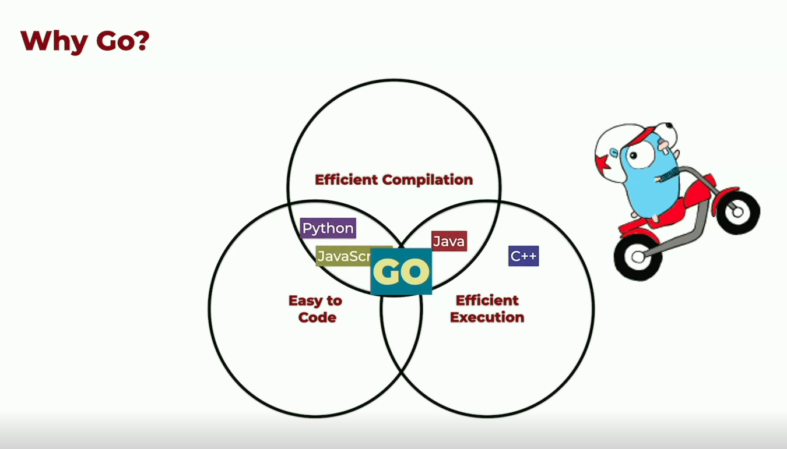

# What is Go?

- Created by Google from scratch (not built on C/C++) in 2011.
- Open sourced.
- It is not an actual Google's product.
- Google is investing money though.
- It is a multi-purpose programming language.
- It is a multi-platform language.
- Initially it was called Golang as there were some old languages with same name (Go).

## Why go?

1. Easy to code (py, js)
2. Efficient compilation (Java)
3. Efficient execution (C++/ C)

- There wasn't any language that could have a sweet spot between all the above three.
- Go was created keeping all the above three in mind.

- We need to keep these goals in mind cause we will surely ask questions on why certain things in go are done in a weird way and the above three goals are the answers to it.
